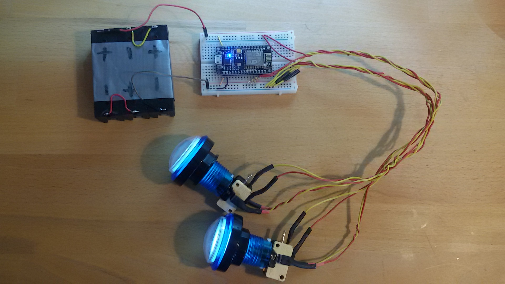

Affenkopp
=========

This project is about reading button states with a nodemcu and use the values
in unity3d for fun and fame and the whole family. Push the buttons to control mapped eyes of an ape.

# Hardware Setup
* 3x 3,7V 18650 (from old notebook batteries)
  * in series (11,1V) 
  * battery case
* 1x nodemcu (8€)
  * remember to disconnect the batteries before you hook up USB cable!!!
* 2x arcade buttons with LEDs (3€ each)
* 2x 22kOhm resistor

### optional for battery monitoring
* 330kOhm + 22kOhm resistor (voltage divider)
* 1x mini LED Voltmeter 3-30V (3€)



* wifi access point
  * its ssid & password must be hard coded in .ino file
  * also acts as mqttbroker
* small computer which runs unity3d
* projector mapping an ape shape

## Buttons
* easy as: https://www.arduino.cc/en/tutorial/button
* button 1 & 2 at nodemcu D1 & D2
* LED inside button are wired straight to batteries (7-12V)


# Connection
Two ways to transmit the buttonstateinfo...

## Wifi Client
nodemcu connects as client to wifi access point
* no long wires needed for buttons
* needs power supply
* needs separate wifi ap

## USB
* no extra power supply needed for nodemcu


# Software

## How does the information of a pressed button reach the unity pc?

### use "Serial.print(...)" on nodemcu via USB to computer
* http://answers.unity3d.com/questions/179311/unity-to-arduino.html
* https://www.youtube.com/watch?v=9SYt4MDSAro

### nodemcu as simple http server
* fetching data in unity via http
* send requests from pc multiple times a second 
  * works with upto 30 requests per second
  * `time for i in {1..1000}; do curl -s --url http://172.16.0.135/buttons; done`
* https://docs.unity3d.com/Manual/UnityWebRequest-RetrievingTextBinaryData.html
* https://github.com/andyburke/UnityHTTP

### nodemcu as http client, webserver on pc/unity?
* request a url if button is pressed
* https://www.myelectronicslab.com/tutorial/door-sensor-with-push-notification-using-esp8266-nodemcu/

### mqtt messages via broker
* the IoT way of sending messages, fast and without overhead
* needs a broker like "mosquitto"
  * available for linux, windows and openwrt
* mqtt clients
  * arduino
    * https://pubsubclient.knolleary.net/ -- pubsubclient
    * https://github.com/gonzalo123/mqtt_example
    * mqttclient
  * python
    * paho-mqtt 
    * https://github.com/sumnerboy12/mqtt-gpio-monitor/blob/master/mqtt-gpio-monitor.py    
  * micropython
    * umqtt.simple micropython client
    * https://github.com/gonzalo123/mqtt_example
  * unity
    * https://github.com/vovacooper/Unity3d_MQTT
    * https://m2mqtt4unity.codeplex.com
    * http://www.hivemq.com/blog/mqtt-client-library-encyclopedia-m2mqtt

#### mqtt broker on debian stretch
```
aptitude install mosquitto
cp path_to_this_git/mosquitto.conf /etc/mosquitto/conf.d/
mosquitto_sub -d -h localhost -t "buttons" -t "node"
```

#### mqtt broker on openwrt
```
opkg update; opkg install mosquitto-nossl
vi /etc/mosquitto/mosquitto.conf
```
* https://github.com/remakeelectric/owrt_pub_feeds

### websockets
* http://www.instructables.com/id/Esp8266Websockets-RGB-LED-controller/
* https://github.com/ghtomcat/ArduinoWebsocketServer
* https://forum.unity3d.com/threads/unity5-beta-webgl-unity-websockets-plug-in.277567/
* https://github.com/sta/websocket-sharp

## Unity on Linux
https://forum.unity3d.com/threads/unity-on-linux-release-notes-and-known-issues.350256/
